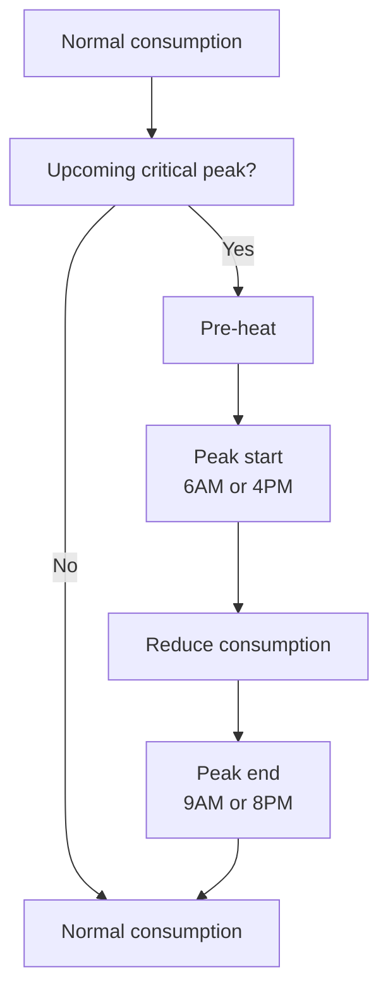
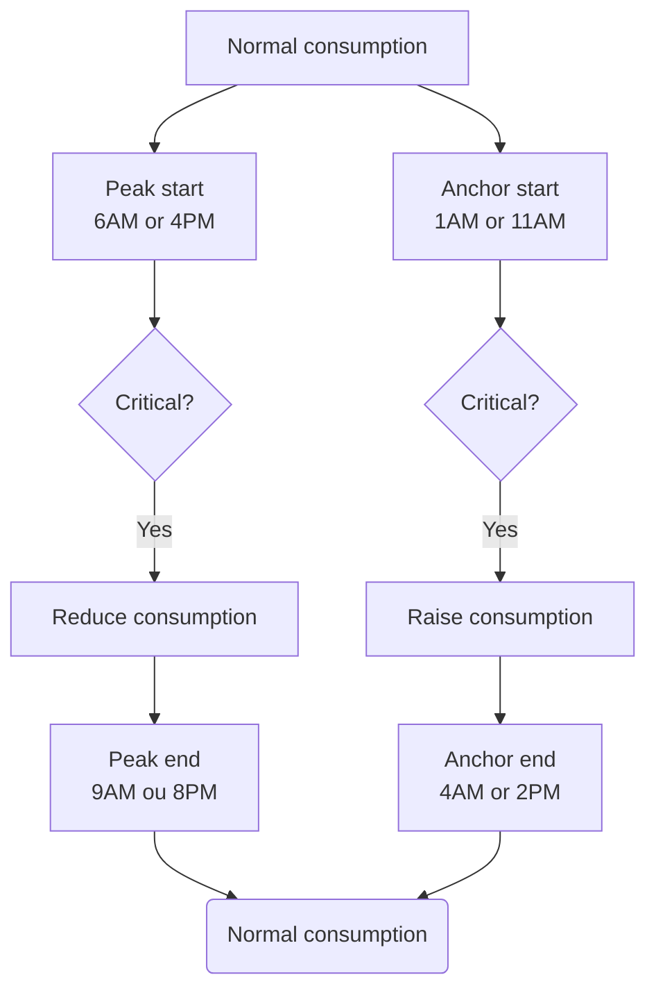
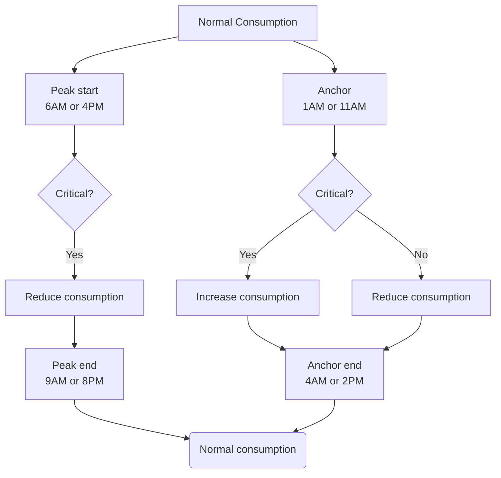

The following information is derived from the formulas from this "Régie de l'énergie" filing:

http://publicsde.regie-energie.qc.ca/projets/469/DocPrj/R-4057-2018-B-0062-DDR-RepDDR-2018_10_26.pdf#page=127

## Overview

The winter credit program implement a set of calculations to estimate the real amount of energy you saved during a critical peak event. In short, they use the consumption from the five previous days of the same kind that did not have a critical event (five last weekdays or five last weekend days) to estimate a regular consumption.

They will then estimate the "Temperature effect" using the difference between a set period called the "anchor" period. By comparing the anchor period on the day of the critical event with the ones from the previous five days they are able to estimate how much additionnal consumption is caused by the cooler temperature and add it to the offset energy.

## Basic critical peak logic

The instruction from Hydro-Quebec in regards to the winter credit is to move the consumption that would occur during the critical peak period to the rest of the day.

##### Before the critical peak
They recommend to raise your thermostat setpoints a few hours before the critical peak period to pre-heat the house.

##### During the peak
	Reduce the thermostat setpoint and avoid using power hungry appliances (electric oven, kettle, hot water heater, electric vehicule charger, etc)

##### After the peak
	Resume your normal consumption.

## Optimizations

The following logics influence the calculations used to estimate the energy offset during critical peaks.

The diagrams below does not include pre-heating, but it should be added before the critical peaks as needed.

### Critical Peak day optimisation

The idea is that instead of just moving the critical peak consumption to the rest of the day we try to concentrate it as much as possible during the anchor period. Doing so will increase the calculated temperature adjustment that is used to calculate the critical peak period offset consumption.

### Long term anchor optimisation

By reducing your consumption during anchor periods every day you increase the difference in consumption of the next critical peak anchor period which results in more calculated energy offset during a peak event. This optimisation is low-risk since it only involves reducing your consumption further.

