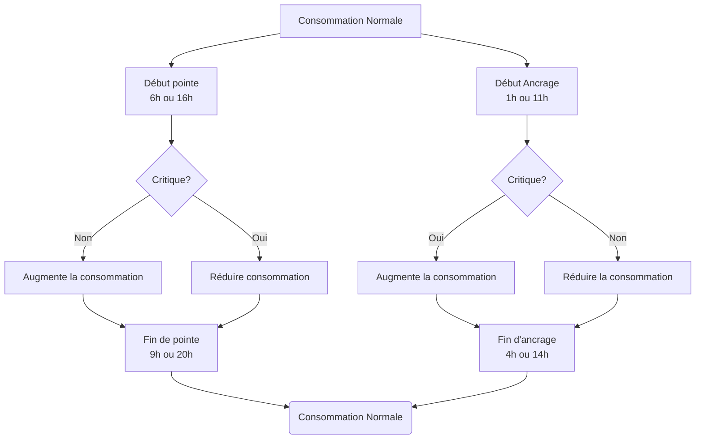

```mermaid
graph TD
	      NormalStart[Consommation Normale] -->PeakStart & AnchorStart
	      PeakStart[Début pointe<br/>6h ou 16h] -->PeakCritical{Critique?}
	      PeakCritical -->|Oui| PeakLowCon[Réduire consommation] 
	      PeakCritical -->|Non| PeakHighCon[Augmente la consommation]
	  
	      AnchorStart[Début Ancrage<br/>1h ou 11h] -->AnchorCritical{Critique?}
	      AnchorCritical -->|Non| AnchorLowCon[Réduire la consommation]
	      AnchorCritical -->|Oui| AnchorHighCon[Augmente la consommation]
	      
	      PeakHighCon --> PeakEnd
	      PeakLowCon --> PeakEnd
	      AnchorHighCon --> AnchorEnd
	      AnchorLowCon --> AnchorEnd
	      PeakEnd[Fin de pointe<br/>9h ou 20h] --> Normal
	      AnchorEnd[Fin d'ancrage<br/>4h ou 14h] --> Normal(Consommation Normale)
```