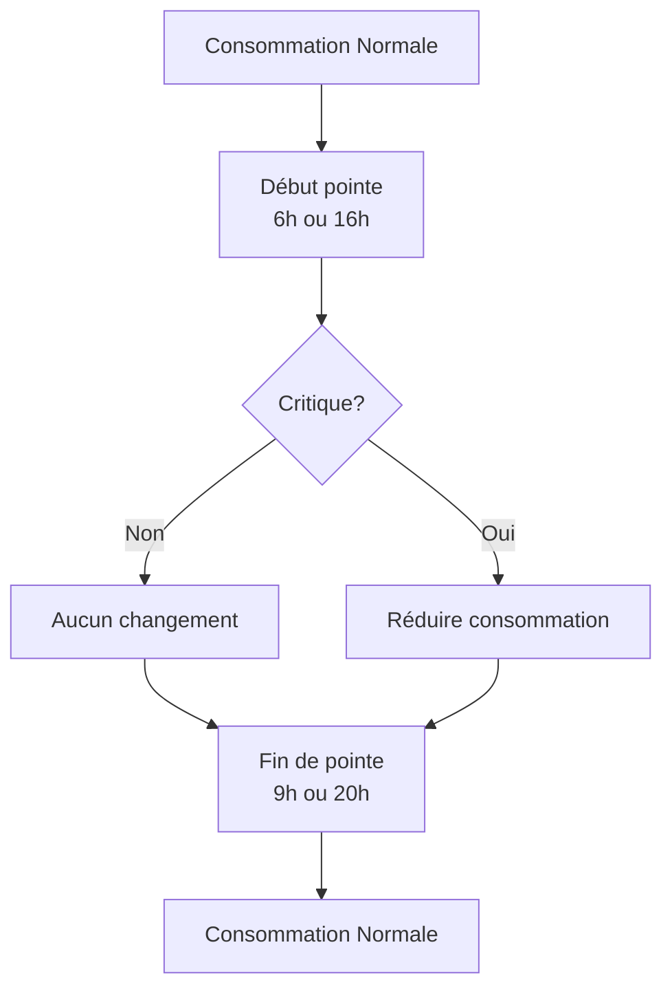
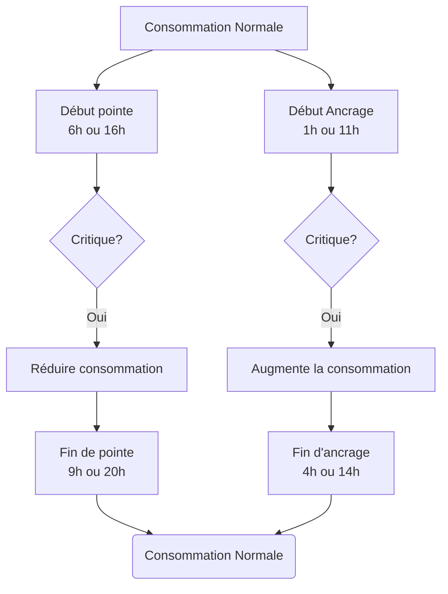
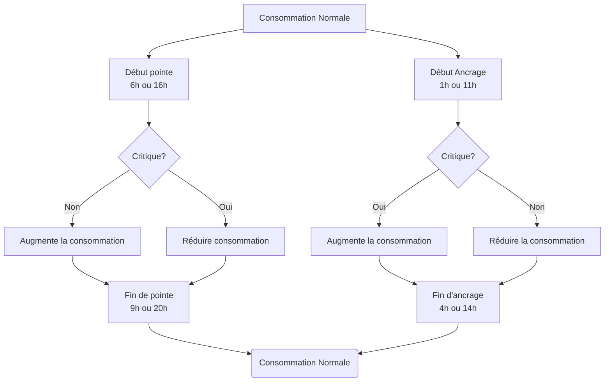

{}A Home-Assistant blueprint implementing these logics is available [here](https://raw.githubusercontent.com/hydroqc/hass-blueprint-hydroqc/main/hydroqc-winter-credits.yaml) or with the magic button here: {}

The following information is derived from the following document and formula from the "Régie de l'énergie" filing:

http://publicsde.regie-energie.qc.ca/projets/469/DocPrj/R-4057-2018-B-0062-DDR-RepDDR-2018_10_26.pdf#page=127

### Basic critical peak logic

The instruction from Hydro-Quebec in regards to the winter credit is to move the consumption that would occur during the critical peak period to the rest of the day. 

**Before the critical peak**
They recommend to raise your thermostat setpoints a few hours before the critical peak period to pre-heat the house.

**During the peak**
	Reduce the thermostat setpoint and avoid using power hungry appliances (electric oven, kettle, hot water heater, electric vehicule charger, etc)

**After the peak**
	Resume your normal consumption.

### Critical Peak day optimisation

The idea is that instead of just moving the critical peak consumption to the rest of the day we try to concentrate it as much as possible during the anchor period. Doing so will increase the calculated temperature adjustment that is used to calculate the critical peak period offset consumption.

### Maximum return optimisation

This optimisation logic is the one that will give you the highest returns from the winter credits program. 

This logic involves moving your consumption not only on days when there is a critical peak event but everyday in order to influence the reference period that is used to estimate the energy offset during critical peak period.

We do not encourage you to use it as it is a bit against the spirit of the winter credit program.

