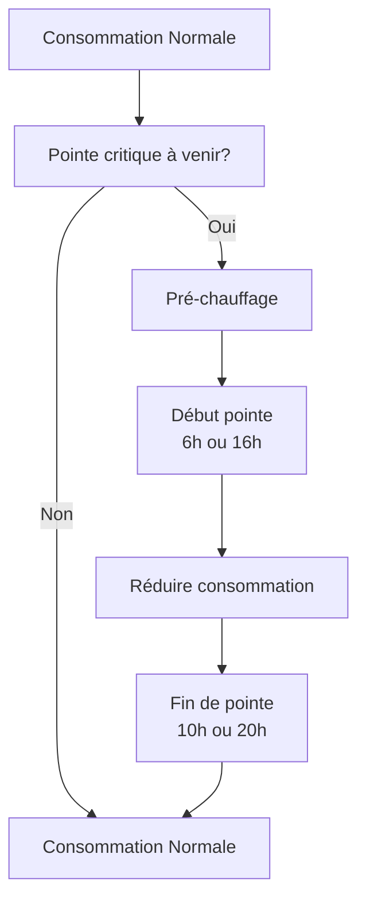
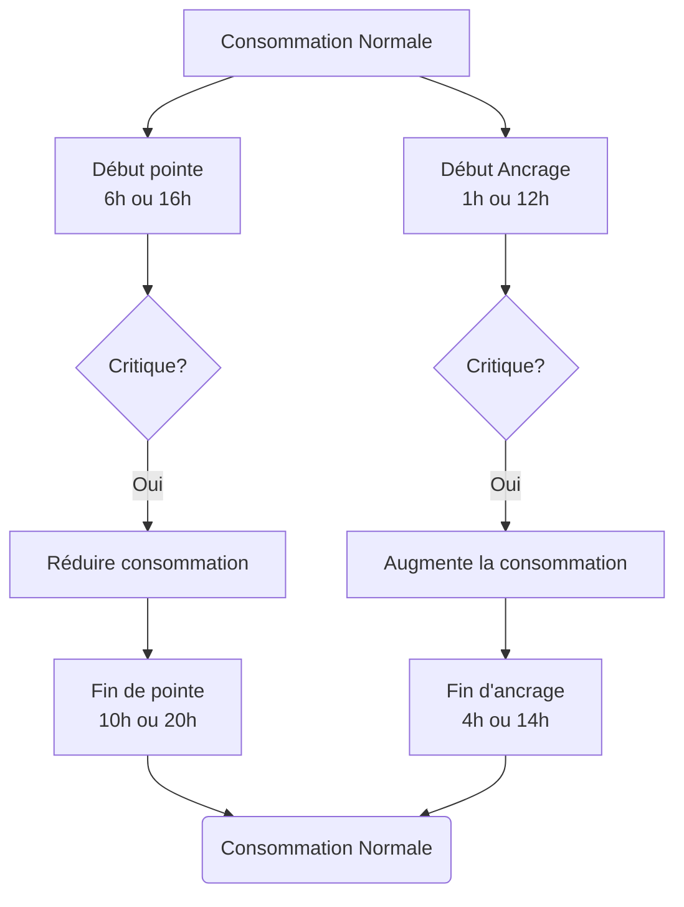
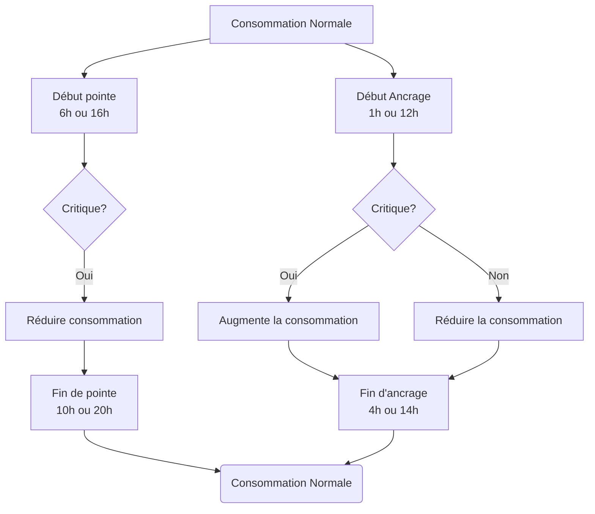

Les informations suivantes sont dérivées des formules de ce dossier soumis à la Régie de L'Énergie par Hydro-Québec:

<http://publicsde.regie-energie.qc.ca/projets/469/DocPrj/R-4057-2018-B-0062-DDR-RepDDR-2018_10_26.pdf#page=127>

## Survol

Le programme de crédit hivernaux met en œuvre un ensemble de calculs pour estimer la quantité réelle d'énergie que vous avez "effacé" lors d'un événement de pointe critique. En bref, ils utilisent la consommation des cinq jours précédents du même genre qui n'avaient pas d'événement critique (cinq jours en semaine ou cinq jours de week-end) pour estimer une consommation "normale".

Ils estimeront ensuite «l’effet de température» en utilisant la différence entre une période définie appelée période d'ancrage. En comparant la période d'ancrage le jour de l'événement critique avec ceux des cinq jours précédents, ils sont en mesure d'estimer la consommation supplémentaire attribuable à la température plus froide et de l'ajouter à l'énergie effacée.

{}**Nouveau plafond sur l'ajustement de température** : Si votre énergie effacée dépasse **40 kWh**, l'ajustement pour la température sera plafonné à 2 fois la consommation moyenne de la période d'ancrage des jours de référence. Cela limite le bénéfice des optimisations agressives. Voir la section [Termes](/fr/docs/tarification-dynamique/winter-credits/terms/#énergie-effacée-et-limitation-nouveau-2025) pour plus de détails.{}

## Logique de base

Les directives d'Hydro-Québec pour la gestion de l'énergie pour le programme de crédit hivernaux est de déplacer la consommation qui se produirait pendant la période de pointe critique à un autre moment de la journée ou de la nuit.

##### Avant une pointe critique

Élevez vos points de consigne de thermostat quelques heures avant la période de pointe critique pour préchauffer la maison.

##### Durant les pointes critiques

Réduisez le point de consigne du thermostat et évitez d'utiliser des appareils gourmand en énergie électrique (four électrique, bouilloire, chauffe-eau, chargeur de véhicules électriques, etc.)

##### Après la pointe critique

Reprendre votre consommation normale.

## Optimisations

Les logiques suivantes viennent influer sur les calculs utilisés pour estimer l'effacement lors des pointes critiques.

Les diagrammes ci-dessous ne comporte pas de pré-chauffage mais celui-ci devrais être ajouté avant les pointes critiques selon les besoins.

### Optimisation le jour de pointe critique

L'idée est qu'au lieu de simplement déplacer la consommation de pointe critique vers le reste de la journée, nous essayons de la concentrer autant que possible pendant la période d'ancrage qui précéde la pointe critique. Cela augmentera "l'effet de température" qui est utilisé pour calculer l'énergie effacé de la période de pointe.

### Optimisation à long terme des ancrages

En réduisant votre consommation pendant les périodes d'ancrage chaque jour, vous augmentez la différence de consommation de la prochaine période d'ancrage de pointe critique, ce qui entraîne un effacement d'énergie plus grand calculé lors d'un événement de pointe. Cette optimisation est à faible risque car elle ne fait que réduire davantage votre consommation.

